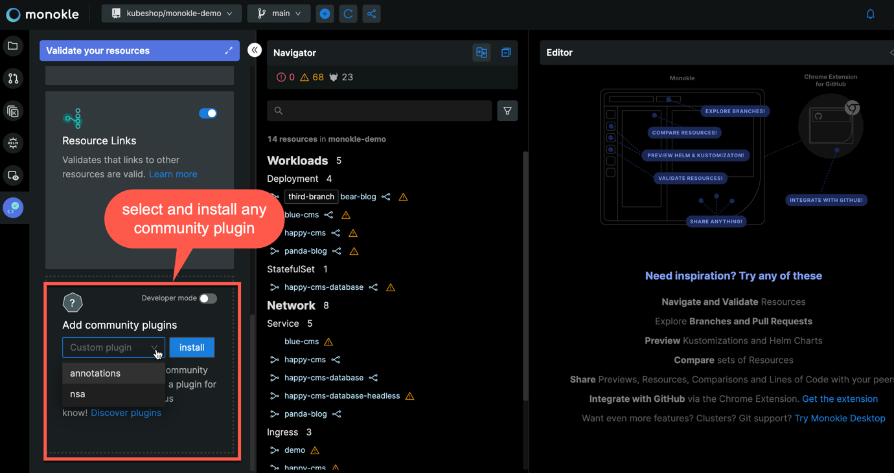
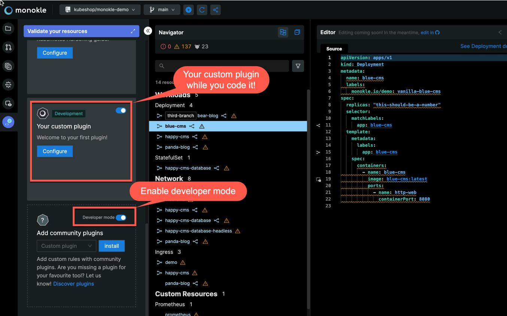

<p align="center">
  
</p>

<p align="center">
Monokle plugins to supercharge your workflows
</p>

<p align="center">
  <a href="https://github.com/kubeshop/monokle-core/tree/main/packages/validation">
    
  </a>
</p>

## Welcome to Monokle community plugins

Monokle community plugins contains all our public validation plugins. 

Plugins are written in Typescript (see example below) and can currently be used in the 
[Monokle CLI](https://github.com/kubeshop/monokle-core/tree/main/packages/cli) and Monokle Cloud (see below).

## Table of content

- [Welcome to Monokle Community Plugins](#welcome-to-monokle-community-plugins)
- [Table of content](#table-of-content)
- [Using community plugins](#using-community-plugins)
  - [In the Monokle CLI](#in-the-monokle-cli)
  - [In Monokle Cloud](#in-monokle-cloud)
  - [In the Monokle GitHub Action](#in-the-monokle-github-action)
- [Creating Plugins](#creating-validation-plugins)
- [Bootstrapping your first plugin](#bootstrapping-your-first-plugin)

## Using community plugins

### In the Monokle CLI

Simply add the name of the validator to your Monokle-CLI [configuration file](https://github.com/kubeshop/monokle-core/blob/main/packages/cli/README.md#configuration).

We will take care of the rest!

```
# monokle.validation.yaml
plugins:
  my-custom-plugin: true
rules:
  my-custom-plugin/my-custom-rule: "err"
```

note: currently this always requires network connectivity to download the plugins. Please consider reaching out for us if you have use 
cases where you need the validators to be cached for offline usage.

### In Monokle Cloud

[Monokle Cloud](https://app.monokle.com) is a free web application where you can explore community plugins directly on public GitHub repositories.

Simply go the validation activity in the left sidebar and select any community plugin within the dropdown. Afterwards all rules and descriptions 
will appear in your application, toggle them to see their impact on your resources in real-time.



## In the Monokle GitHub Action

Simply make sure your plugin is configured as described for the Monokle CLI above and the configuration is 
committed to GitHub. The [Monokle GitHub Action](https://github.com/marketplace/actions/monokle-validation) will use this 
configuration and your plugin accordingly.

## Creating Validation Plugins

Validation plugins are currently written in Typescript (other formats may be supported in the future).

Example plugin that checks if the Admin API is enabled for Prometheus:

```typescript
export const noAdminApi = defineRule({
  id: 3,
  description: "Disallow the admin API for Prometheus instances.",
  help: "Do not set enabledAdminAPI to true.",
  validate({ resources }, { report }) {
    resources.filter(isPrometheus).forEach((prometheus) => {
      const valid = prometheus.spec.enableAdminAPI !== true;
      if (valid) return;
      report(prometheus, { path: "spec.enableAdminAPI" });
    });
  },
});

export default definePlugin({
  id: "YFP",
  name: "Your first plugin",
  description: "Welcome to your first plugin!",
  rules: { noAdminApi },
});
```

**1. Target resources with type-guards**

The [Monokle plugin toolkit](https://github.com/kubeshop/monokle-core/tree/main/packages/plugin-toolkit) will generate 
type guards for both known kinds and any CRDs you might have. Afterwards, resources becomes fully-typed and give IntelliSense
features like autocomplete, build-in documentation and typo prevention.

```typescript
const deployment = resources.find(isDeployment);
const prometheus = resources.find(isPrometheus);
```

**2. Report a problem**

```typescript
report(prometheus, { path: "spec.enableAdminAPI" });
```

Report a problem simply by passing back the resource to our rule API's `report`.
By giving a YAML path to the resource, [Monokle Cloud](https://app.monokle.com/) can show you the error in real-time
in the editor as seen below:


## Bootstrapping your first plugin

> Prerequisites: we recommend to use NPM >v7 and NodeJs LTS.

All community plugins are located within this repository - Since validation plugins can execute arbitrary code 
we need to manually review third-party code to ensure they don't do anything harmful as part of their processing.

Follow the below steps to create your own validation plugin

**1. Fork this repository**

**2. Scaffold plugin**

You can use our [scaffolding tool](https://github.com/kubeshop/monokle-core/tree/main/packages/create-monokle-plugin) to 
create the boilerplate code for your plugin. Execute the following command in the root folder of the forked repository, 

```shell
npm create monokle-plugin@latest
```

This will prompt you for plugin name, type and variant - only one option available for now:

```shell
npm create monokle-plugin@latest
Need to install the following packages:
  create-monokle-plugin@0.3.1
Ok to proceed? (y) 
✔ Project name: … my-monokle-plugin
✔ Select a plugin type: › validation
✔ Select a variant: › validation-ts

Scaffolding plugin in XXX/my-monokle-plugin...

Done. Now run:

  cd my-monokle-plugin
  npm install
  npm run dev
```

**3. Develop your plugin**

The scaffolding tool gives instructions on how to get started.

For validation, simply enable your plugin's development server by running `npm run dev` and enable development
mode in Monokle Cloud




Hot Module Replacement will show your latest code directly in the browser. 

Check the plugin's README to learn how you can generate types for your CRDs and more.

**3. Create a pull request**

Once you're done with your plugin create a pull-request back to our main repository, we'll review the code as 
soon as possible.

Once approved and merged it will be published on plugins.monokle.com and become available for any user of
Monokle CLI or Monokle Cloud.

**4. Enjoy the impact of your plugin on the community**

You're done! The plugin will now be available for everyone to use - great job! 

Thank you for your time to make Kubernetes easier to use.
