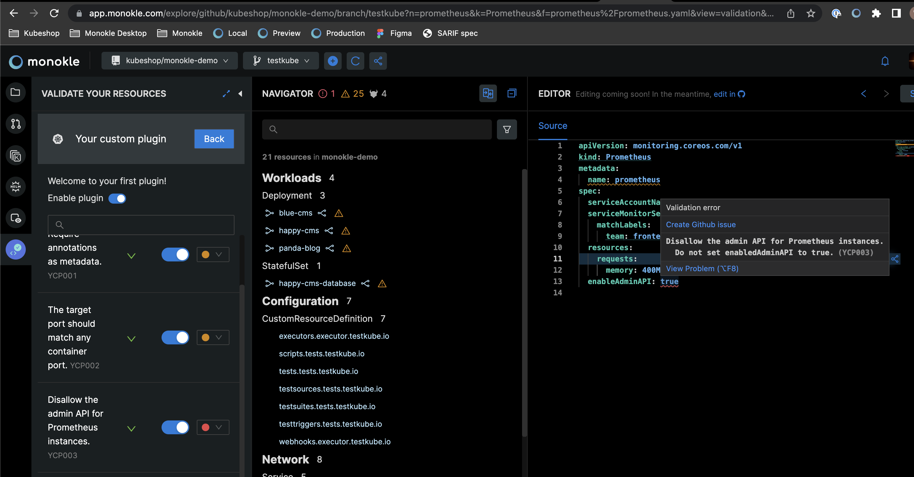

<p align="center">
  
</p>

<p align="center">
Monokle plugins to supercharge your workflows
</p>

<p align="center">
  <a href="https://github.com/kubeshop/monokle-core/tree/main/packages/validation">
    
  </a>
</p>

## Welcome to Monokle community plugins

Monokle community plugins is the home for all our plugins.

We currently support the following custom plugins:

- TypeScript validator: add custom rules for your CRDs and more.

## Table of content

- [Welcome to Monokle community plugins](#welcome-to-monokle-community-plugins)
- [Table of content](#table-of-content)
- [Installing community plugins](#installing-community-plugins)
  - [Through the Monokle Configuration file](#through-the-monokle-configuration-file)
  - [Through the user interface](#through-the-user-interface)
- [Plugins](#plugins)
  - [TypeScript validator](#typescript-validator)
- [Bootstrapping your first plugin](#bootstrapping-your-first-plugin)

## Installing community plugins

### Through the Monokle Configuration file

Simply add the name of the validator to your Monokle Configuration file.

We will take care of the rest!

```
# monokle.validation.yaml
plugins:
  my-custom-plugin: true
rules:
  my-custom-plugin/my-custom-rule: "err"
```

note: currently this always requires network connectivity to download the plugins. Please consider reaching out for us if you have use cases where you need the validators to be cached for offline usage.

### Through the user interface

You can [visit Monokle Cloud](https://app.monokle.com); a free web application where you can explore community plugins directly on public GitHub repositories.

Simply go the validation activity in the left sidebar and you can select any community plugin within the dropdown. Afterwards all rules and descriptions will appear in your application, toggle them to see their impact on your resources in real-time.

## Plugins

### TypeScript validator

Example plugin:

```typescript
export const noAdminApi = defineRule({
  id: 3,
  description: "Disallow the admin API for Prometheus instances.",
  help: "Do not set enabledAdminAPI to true.",
  validate({ resources }, { report }) {
    resources.filter(isPrometheus).forEach((prometheus) => {
      const valid = prometheus.spec.enableAdminAPI !== true;
      if (valid) return;
      report(prometheus, { path: "spec.enableAdminAPI" });
    });
  },
});

export default definePlugin({
  id: "YFP",
  name: "Your first plugin",
  description: "Welcome to your first plugin!",
  rules: { noAdminApi },
});
```

**1. Target resources with type-guards**

```typescript
const deployment = resources.find(isDeployment);
const prometheus = resources.find(isPrometheus);
```

Our Monokle plugin toolkit will generate these for both known kinds and any custom resource definition you might have. Afterwards, resources becomes fully-typed and give IntelliSense
features like autocomplete, build-in documentation and typo prevention.

**2. Report a problem**

```typescript
report(prometheus, { path: "spec.enableAdminAPI" });
```

Report a problem simply by passing back the resource to our rule API's `report`.
By giving a YAML path to the resource, [Monokle Cloud](https://app.monokle.com/) can show you the error in real-time
in the editor as seen below:



## Bootstrapping your first plugin

> Prerequisites: we recommend to use NPM >v7 and NodeJs LTS.

All community plugins are located within this repository.
The reason is that safety of our users is important to us.
Validation plugins can execute arbitrary code.
For this reason we'll manually review third-party code running on your browser and servers.

**1. Fork the repository**

**2. Skaffold plugin**

You can use our skaffolding tool to get a template of the plugin.

Execute the following command and it will interactively guide you through creating your plugin.

```
npm create monokle-plugin@latest
```

**3. Develop your plugin**

The skaffolding tool gives instructions on how to get started.

For validation, simply enable your plugin's development server. Hot Module Replacement will show your latest code directly in the browser. You can also check the plugin's README to learn how you can generate types for your CRDs and more.

**3. Create a pull request**

We'll review the code as soon as possible.

It will afterwards be published on plugins.monokle.com and become available for everyone to load.

**4. Enjoy the impact of your plugin on the community**

Your done! The plugin will now be available for everyone to use.

Thank you for your time to make Kubernetes easier to use.
